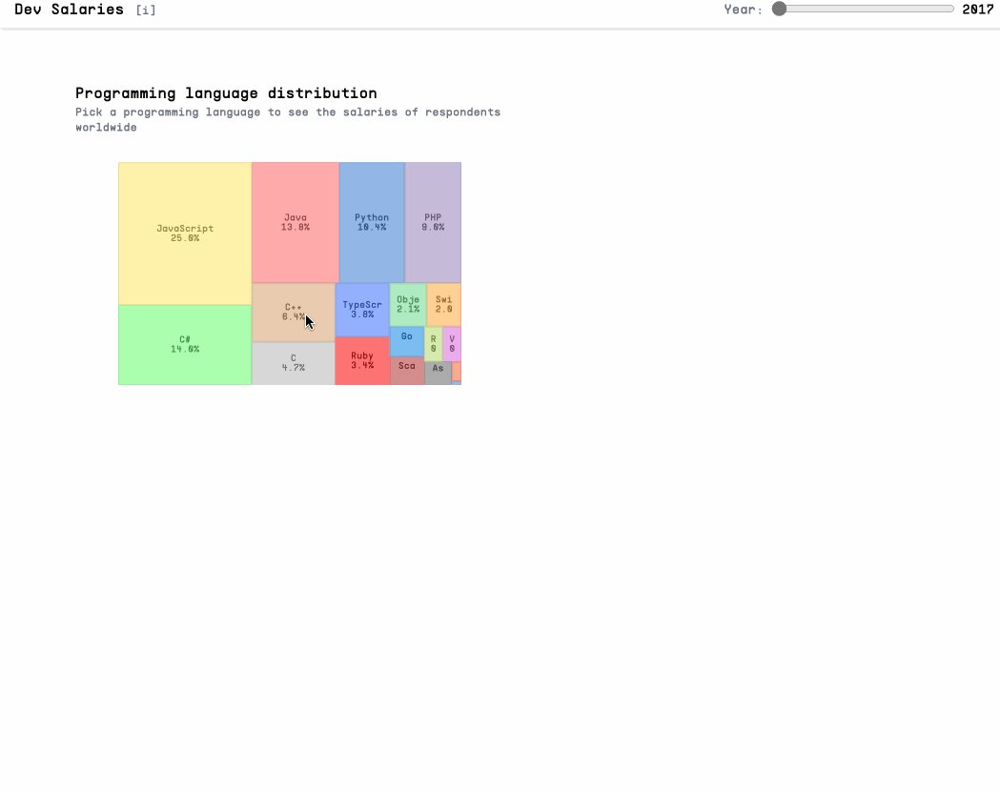

# PV251 Visualization Project

This repository contains the source code for the visualization project in the [PV251](https://is.muni.cz/course/fi/autumn2024/PV251) course at FI MUNI.

## Demo

> Live demo at [https://hadamove.github.io/pv251_project/](https://hadamove.github.io/pv251_project/)

---

## Overview

- **Topic**: Analysis of developer salary data across countries and programming languages.
- **Data Source**: [Stack Overflow Developer Survey](https://insights.stackoverflow.com/survey).
- **Technologies Used**: React, Vite, ECharts, TailwindCSS, Python, Jupyter Notebook.

---

## Setup Instructions

### [Optional] Data Preprocessing

The data preprocessing is implemented in the `preprocess.ipynb` Jupyter notebook.

#### Requirements:
1. **Python 3.10**
2. Install dependencies:
   - Recommended: `uv sync` ([uv documentation](https://docs.astral.sh/uv/))
   - Alternative: `poetry install`  
   - Or: `pip install -r requirements.txt`
3. Run the notebook to:
   - Download raw survey data.
   - Extract relevant data for the app.
   - Save the processed file for use in the application.

*Note*: Preprocessed data is included in the repository. You can skip this step if you only wish to run the app.

---

### Running the App

1. Install dependencies: `npm i`.
2. Install Vite globally: `npm install -g vite`.
3. Start the app: `vite dev`.
4. Access the app at: `localhost:5173`.
